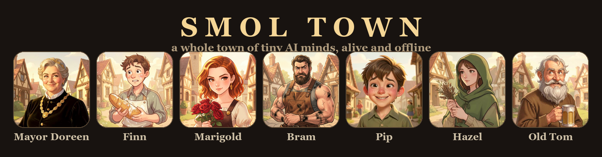
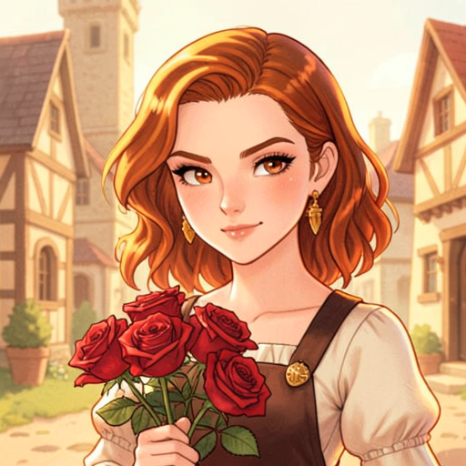
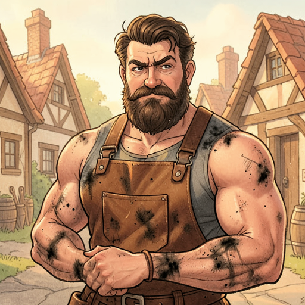
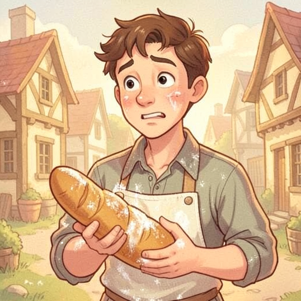
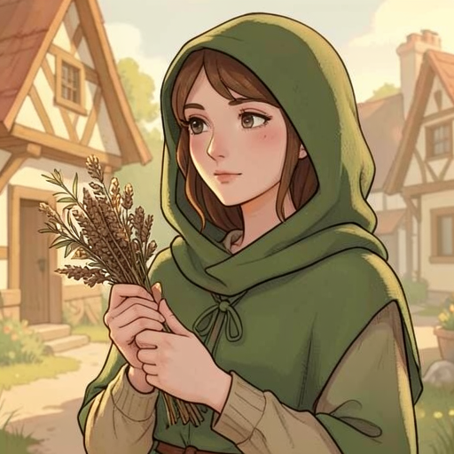

<p align="center">
  
</p>

<h1 align="center">🏘️ Smol Town</h1>
<p align="center"><b>A whole town of tiny AI minds — alive, gossiping, and feuding on your laptop. Fully offline.</b></p>

<p align="center">
  <a href="https://huggingface.co/spaces/build-small-hackathon/smol-town"></a>
  
  
  
</p>

<p align="center"><i>Big labs need a datacenter to run one mind.<br><b>Smol Town runs a whole town of them on a gaming GPU.</b></i></p>

---

## ✨ What is this?

Seven villagers live in **Tinbury**. Each is its own **small-model agent** — a personality, a **secret**, and feelings about the others. They wake into a brewing scandal and just… **improvise**: falling in love, spilling secrets, throwing thorns. You watch the feed and stir the pot with **god-power events** ("a stranger rides into town").

No cloud APIs. No giant model. **Every mind runs locally, in the Space, on ZeroGPU.**

👉 **[Open the town →](https://huggingface.co/spaces/build-small-hackathon/smol-town)** then hit **Next beat** and watch the drama escalate.

## 🎭 Meet the cast — *everyone has a secret*

| | Who | …and what they're hiding |
|:--:|:--|:--|
|  | **Old Tom** · _the drunk philosopher_ | Saw who emptied the town treasury — and blurts it out after enough cider. |
|  | **Mayor Doreen** · _the mayor_ | _She's_ the one who emptied it — blew it all on a marble fountain. |
|  | **Marigold** · _the florist_ | Still in love with her ex, Bram. Would rather die than admit it. |
|  | **Bram** · _the blacksmith_ | Kept every letter Marigold ever wrote him, in a tin box. |
|  | **Finn** · _the baker_ | Hopelessly in love with Marigold — far too shy to say a word. |
|  | **Pip** · _the gossip kid_ | Knows everyone's secret and trades them like marbles. |
|  | **Hazel** · _the herbalist_ | Came to Tinbury to quietly find her birth mother — who may live here. |

<sub>Portraits generated locally with **FLUX.2 [klein]**.</sub>

## 📜 A morning in Tinbury — *completely unscripted*

> 📢 *The fountain fund is gone — and Old Tom just named who emptied it.*
>
> 🍺 **Old Tom:** Did you lot know Doreen's been siphoning the treasury into garden gnomes?
> 🎩 **Mayor Doreen:** How *dare* you — those gnomes are a **tourist attraction!**
> 🌹 **Marigold:** *(throws thorns at Bram's feet)* Better watch that tongue, **lover**.
> 🔨 **Bram:** *(silently pockets the thorns)*

Nobody wrote that. The agents did.

## ⚙️ How it works

- **7 agents, one tiny model.** Each villager is a persona + a rolling **memory** of recent events. A tick loop picks who acts next (biased toward whoever was just mentioned), so lines *chain* into drama.
- **Emergent, not scripted.** Secrets + relationships + a juicy opening event = a soap opera that writes itself.
- **God mode.** Inject any event and watch the town react.
- **Truly offline.** The model runs in-Space — nothing leaves the machine.
- **Share-card.** One click turns the current scene into a postable PNG.

## 🛠️ Built with

`small models only` (the whole point) · **Qwen3-4B** agents (≤4B) · **FLUX.2-klein-4B** portraits · **Gradio** + **ZeroGPU** · 100% offline

## 🚀 Run it yourself

```bash
git clone https://github.com/siddhant-rajhans/smol-town
cd smol-town
pip install -r requirements.txt
python app.py            # point OLLAMA_BASE_URL at a local Ollama — or just open the live Space
# or watch it run headless:
python town.py 12
```

## Agent traces

Every generated town beat records a structured trace with `tick`, `speaker`, `role`, `model`,
`context` (the recent feed lines shown to the model), `system`, `output`, and an ISO-8601 UTC
`ts`. In the app, click **Download town trace** to export the current session as JSONL.

To publish an exported trace as an Apache-2.0 Hugging Face dataset:

```bash
HF_TOKEN=hf_... python scripts/publish_trace.py \
  --repo-id your-name/smol-town-traces \
  --file smol-town-trace.jsonl
```

The publisher validates the JSONL, uploads it under `data/`, and creates a dataset-card README
describing the schema.

## 🏆 Built for the [Build Small Hackathon](https://huggingface.co/build-small-hackathon)

*Think small: ≤32B params, a Gradio Space, and have fun with tiny, tinkerable models.* Smol Town's whole pitch **is** the constraint — a town of minds that only makes sense *because* the models are small enough to run a crowd of them at once.

---

<p align="center"><b>If a town of tiny minds bickering made you smile, leave a ⭐ here<br>— and a ❤️ on the <a href="https://huggingface.co/spaces/build-small-hackathon/smol-town">Space</a>.</b></p>
